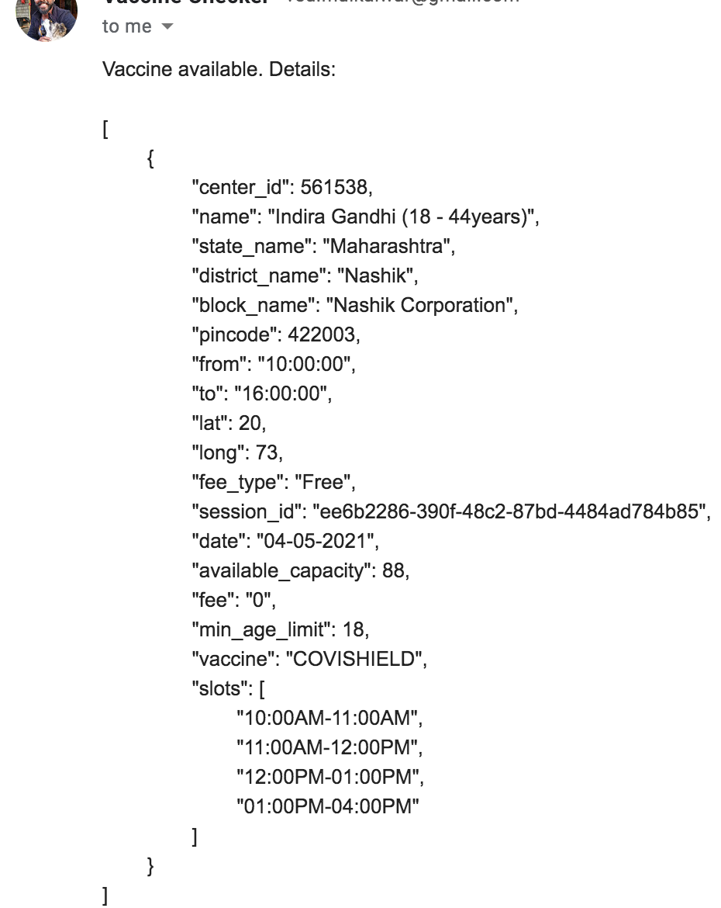

# India Vaccine Slot Availability Notifier For India
Vaccine Slot Availability Notifier.
Now no need to check cowin portal to see available slots for covid19 vaccine. Instead get a call and email when a slot opens up!

This code sends a call and a email every minute when slot opens up till they are available; for a given age and in specified pincodes.

 Steps to run the script:  

Step 1) Enable application access on your gmail with steps given here:
https://support.google.com/accounts/answer/185833?hl=en
Add the password you got to .env file's "APPLICATION_PASSWORD" value
\
\
Step 2) Create a twilio account:
https://www.twilio.com/console/voice/build/getting-started
No need to add credit card details. A trail account also works within demo limits. Just use the twilio demo provided "from" call number and your whitelisted "to" phone number.
\
\
Step 3) Enter the details in the file .env, present in the same folder
\
\
Step 4) Make sure you have Nodejs installed. Can be checked by ruinning `node --version` in terminal. If not, please install it.
\
\
Check if emails are proper by sending dummy notification) On your terminal run: `node start testNotifier.js`
(PS: If email is not being shown in your primary inbox or no notification: Go to Promotions inbox and move email it to primary inbox)
\
\
Check if phone call is proper by sending dummy call) On your terminal run: `node start testCaller.js`
\
\
Step 5) On your terminal run: `npm i && pm2 start vaccineNotifier.js` (if you are getting failed to install pm2, run `npm i -g pm2` first)
\
\
Step 6) On your terminal run: `pm2 logs vaccineNotifier` to checkif your script is running properly
\
\
Final Step) To close the app run: `pm2 stop vaccineNotifier.js && pm2 delete vaccineNotifier.js`
\

Here's a sample of the resultant emails:

\
\
Inspired from this repo -> https://github.com/kartikey54/VaccineAvailabilityNotifier 
